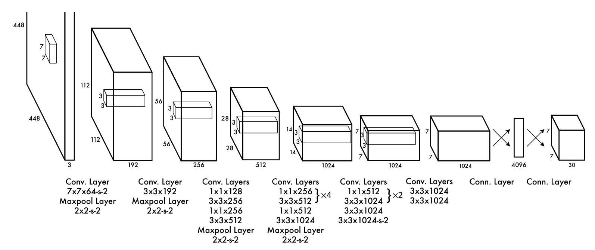
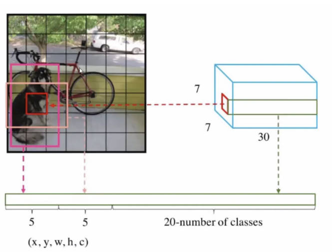
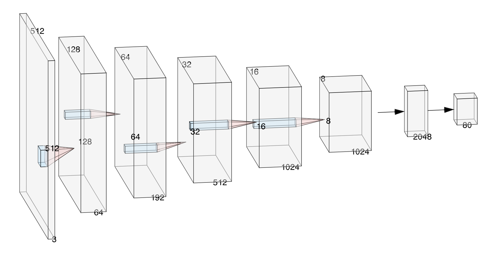

# YOLOv1_QR Project

本项目基于 YOLOv1 改进用于二维码检测，涵盖训练、评估、预测及实时摄像头检测功能。原版 YOLOv1 支持 20 类目标检测，但在某些特定场景中我们只需检测定位一种物体，因此本项目对yolo1网络进行了修改和简化，对于初学者是一个很令人惊喜的实践。

本项目效果展示如下：
<p align="center">
  
  
</p>
<p align="center">
  <em>左：测试集图片检测样例 &nbsp;&nbsp;&nbsp; 右：电脑摄像头实时检测演示</em>
</p>

## 1. YOLOv1 原理简介
如果您想直接开始使用本项目，无需了解 YOLOv1 的原理，您可以直接跳转到 [本项目使用教程](#3-本项目使用教程) 部分。

YOLOv1 是一种单阶段目标检测算法，其核心思想是将目标检测问题转化为回归问题。
### 1.1 YOLOv1 网络结构



*   **网格划分 (Grid Split)**: 将输入图像划分为 $7 \times 7$ 的网格。如果一个物体的中心落在某个网格内，该网格就负责检测该物体。
*   **边界框回归 (Bounding Box Regression)**: 每个网格预测 $2$ 个边界框 (Bounding Box)。每个边界框包含 5 个预测值： $x, y, w, h$  (位置与大小) 和 $confidence$ (置信度)。
    *   $x, y$: 边界框中心相对于网格单元的偏移。
    *   $w, h$: 边界框相对于整张图像的宽高。
    *   $confidence$: 预测框包含物体的概率 $\times$ 预测框与真实框的 IoU。
*   **类别概率 (Class Probability)**: 每个网格还需要预测 $20$ 个类别的条件概率。
    * 分析：每个网格需要得到 $2$ 个边界框的预测值，每个边界框包含 $5$ 个值，加上 $20$ 个每一类的概率，总共是 $2 \times 5 + 20 = 30$ 个值。可以看到符合最终输出的 $7 \times 7 \times 30$ 的格式。
<p align="center">
  
</p>

### 1.2 YOLOv1 损失函数
$$
Loss = \lambda_{coord} \cdot Loss_{coord} + \lambda_{noobj} \cdot Loss_{noobj} + Loss_{conf} + Loss_{class}
$$

**四大损失项分别对应：**
1. **边界框坐标损失：** 优化有目标网格中与真实框 IOU 最大的预测框的位置和尺寸，根号是为了防止大尺寸的偏差影响大于小尺寸。一般取 $\lambda_{coord} = 5$

$$
Loss_{coord} = \sum_{i=0}^{S^2} \sum_{j=0}^{B} \mathbb{I}_{ij}^{obj} \left[
(x_{ij} - \hat{x}_{ij})^2 + (y_{ij} - \hat{y}_{ij})^2 +
(\sqrt{w_{ij}} - \sqrt{\hat{w}_{ij}})^2 + (\sqrt{h_{ij}} - \sqrt{\hat{h}_{ij}})^2
\right]
$$

2. **无目标置信度损失：** 优化有目标网格中最优预测框的置信度（使预测置信度接近真实 IOU）， 一般取 $\lambda_{noobj} = 0.5$

$$
Loss_{noobj} = \sum_{i=0}^{S^2} \sum_{j=0}^{B} \mathbb{I}_{ij}^{noobj} (C_{ij} - \hat{C}_{ij})^2
$$

3. **有目标置信度损失：** 优化有目标网格中最优预测框的置信度（使预测置信度接近真实 IOU）

$$
Loss_{conf} = \sum_{i=0}^{S^2} \sum_{j=0}^{B} \mathbb{I}_{ij}^{obj} (C_{ij} - \hat{C}_{ij})^2
$$

4. **类别损失：** 优化有目标网格的类别概率（使预测类别分布接近真实类别）

$$
Loss_{class} = \sum_{i=0}^{S^2} \sum_{c \in classes} \mathbb{I}_{i}^{obj} (p_{i,c} - \hat{p}_{i,c})^2
$$

**符号说明：**
*   $S$: 网格数量（例如 $7 \times 7 = 49$）。
*   $B$: 每个网格预测的边界框数量（默认值为 $2$）。
*   $\mathbb{I}_{ij}^{obj}$: 指示函数，当第 $i$ 个网格的第 $j$ 个边界框负责预测物体时为 1，否则为 0。
*   $\mathbb{I}_{i}^{noobj}$: 指示函数，当第 $i$ 个网格的第 $j$ 个边界框**不**负责预测物体时为 1，否则为 0。
*   $x_i, y_i, w_i, h_i$: 真实框的中心坐标和宽高（归一化后）。
*   $\hat{x}_i, \hat{y}_i, \hat{w}_i, \hat{h}_i$: 预测框的中心坐标和宽高。
*   $C_i, \hat{C}_i$: 真实置信度和预测置信度。
*   $p_i(c), \hat{p}_i(c)$: 真实类别概率和预测类别概率。

### 1.3 论文训练配置
1. **数据集**：基于PASCAL VOC 2007/2012的训练集和验证集训练135轮；测试2012数据集时，额外加入2007测试集用于训练。
2. **训练参数**：批次大小为64；优化器用**SGD**（动量0.9，权重衰减0.0005）。
3. **学习率策略**：先从1e-3逐步升至1e-2，再以1e-2训练75轮、1e-3训练30轮、1e-4训练30轮。
4. **防过拟合措施**：
    1. 第一全连接层后加**dropout**层（丢弃率0.5）
    2. 数据增强包括**随机缩放平移**（最大20%原图尺寸）、**HSV色域曝光与饱和度调整**（最大1.5倍）

### 1.4 预测
**一、输入图像预处理**：将任意尺寸的输入图像缩放到 448×448（YOLOv1 固定输入尺寸），保证图像通道为 RGB，像素值归一化到 0~1 区间（或按训练时的归一化规则处理）。

**二、网络前向推理（核心输出生成）**：将处理后的图像输入到 YOLOv1 网络中，得到 7x7x30 的输出。7x7个网格中每个网格包含2个边界框，每个边界框包含5个值：$x, y, w, h, conf$以及20个类别概率。

**三、边界框坐标还原**：网络输出的 \(x, y, w, h\) 是相对于网格单元的偏移值，需还原为图像的绝对像素坐标

**四、计算边界框的最终置信度** ：网络输出的 \(\text{conf}\) 是 “网格内存在目标的置信度 × 预测框与真实框的 IoU”，需结合类别概率得到类别置信度（最终筛选依据）：

$$
\text{最终置信度} = conf \times \text{Pr}(Class_{i} | \text{Object})
$$


**五、置信度阈值过滤**：设定置信度阈值（如 0.5），舍去所有类别置信度低于阈值的边界框，大幅减少候选框数量。

**六、非极大值抑制 (NMS)**： 用于过滤掉重叠度高的预测框，避免不同框多次预测同一个步骤如下：
1. 对每个类别，按置信度从高到低排序预测框。
2. 选择置信度最高的框，将其加入结果列表。
3. 计算该框与其他框的 IoU（重叠度），删除 IoU 大于阈值（如 0.5）的框。
4. 重复步骤 2-3，直到所有框都被处理。

**七、输出结果**：将经过 NMS 后的边界框、对应类别、置信度输出。

### 1.5 yolo1评价
* 优点
  1. **速度极快**：首创“端到端单阶段检测”，将检测转化为回归问题，适合实时场景。
  2. **全局视野**：基于整幅图像推理，对目标整体上下文理解更好。
  3. **结构简洁**：仅由卷积层+全连接层构成，易部署、易训练。

* 缺点
  1. 小目标检测能力弱（且长宽比两个太少）
  2. 边界框预测精度低
  3. 对密集目标检测效果差（重叠不行）
  4. 召回率有限

## 2. 本项目介绍

本项目使用 PyTorch 实现，针对二维码数据集进行训练。

<p align="center">
  
</p>

1. **数据集**:yolov5二维码检测数据集（3100+张）。 [百度网盘链接](https://pan.baidu.com/s/1lkTu3XnFazSehs8GgNzVfg?pwd=3qu6) 提取码: 3qu6

2. **模型**: 修改了部分 YOLOv1 网络尺寸，专用于单类别（QR Code）检测。预测类别修改为单类别（C=1），网格数量由7x7改为4x4（S=4），因为使用的二维码数据集在图中的占比大致为40%，而7x7网格会导致目标检测能力弱。

3. **功能**: 支持断点续训、测试集指标评估 (mIoU, Precision, Recall, ap@0.5)、可视化预测结果、摄像头实时检测与录制。

### 2.1 本项目损失函数公式

由于本项目仅检测二维码（C=0，不计算分类损失），公式简化如下：

$$
\begin{aligned}
Loss &= \lambda_{coord} \sum_{i=0}^{S^2} \mathbb{1}_{i}^{obj} [(x_i - \hat{x}_i)^2 + (y_i - \hat{y}_i)^2] \\
&+ \lambda_{coord} \sum_{i=0}^{S^2} \mathbb{1}_{i}^{obj} [(\sqrt{w_i} - \sqrt{\hat{w}_i})^2 + (\sqrt{h_i} - \sqrt{\hat{h}_i})^2] \\
&+ \sum_{i=0}^{S^2} \mathbb{1}_{i}^{obj} (C_i - \hat{C}_i)^2 \\
&+ \lambda_{noobj} \sum_{i=0}^{S^2} \mathbb{1}_{i}^{noobj} (C_i - \hat{C}_i)^2
\end{aligned}
$$

**与原yolo1的主要区别**:
1.  **移除分类损失**: 删除了最后一项 $\sum (p_i(c) - \hat{p}_i(c))^2$，因为只有一类（QR Code）。
2.  **数值稳定性**: 代码中对 $w, h$ 开根号前进行了 `clamp(min=1e-6)` 处理，防止梯度爆炸。
## 3 本项目使用教程
### 3.1 环境配置

**主要依赖库**:
*   Python >= 3.8
*   PyTorch (建议 GPU 版本)
*   torchvision
*   opencv-python
*   Pillow
*   tqdm
*   PyYAML

## 3.2 快速开始

### 3.2.1 训练 (Training)
在 `config.yaml` 中的train部分配置训练参数，如数据集路径、批量大小、学习率等。然后在终端运行训练脚本：

```bash
python train.py
```

*   **输出**: 日志和模型权重保存在 `logs/` 目录下。

### 4.3 预测 (Prediction)

`predict.py` 支持两种模式：单张图片预测和测试集评估。

**1. 单张图片预测**
预测单张图片，将检测框画在图上并显示置信度，保存到指定目录。

```bash
# 使用命令行参数
python predict.py --config ./config.yaml --image ./dataset/images/test/sample.jpg --out ./predictions/single

# 或者仅使用 config.yaml 中的配置
python predict.py --config ./config.yaml
```

**2. 测试集评估**
评估整个测试集，计算 Precision, Recall, mIoU 等指标。

```bash
python predict.py --config ./config.yaml --test
```

### 4.4 实时检测 (Webcam)

使用电脑摄像头进行实时二维码检测。

```bash
python webcam_detect.py --config ./config.yaml
```

**参数说明**:
*   `--index`: 摄像头索引（默认 0）。例如使用第二个摄像头：`--index 1`。
*   `--record`: 启动时直接开始录制视频。

**按键操作**:
*   **`q`**: 退出程序。
*   **`r`**: 开始/停止 录制视频。录制的视频将保存在 `config.yaml` 中 `live_save_dir` 指定的目录。

## 5. 目录结构说明

```
yolo1_QR/
├── config.yaml         # 项目配置文件
├── train.py            # 训练脚本
├── predict.py          # 预测与评估脚本
├── webcam_detect.py    # 摄像头实时检测脚本
├── models/             # 模型定义
│   ├── yolov1QR.py     # YOLOv1 网络结构
│   ├── loss.py         # 损失函数
│   └── ...
├── utils/              # 工具函数
├── dataset/            # 数据集目录
└── logs/               # 训练日志与权重保存目录
```
